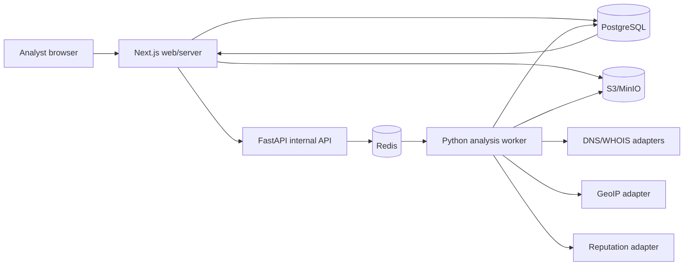

# MailSentinel AI — Prototype Implementation Plan

> **Problem Statement:** AI-Powered Email Threat Detection, Geolocation and Forensic Intelligence Platform
> **Prototype goal:** Build a reliable, explainable, end-to-end demonstration in which an authorized analyst uploads a raw `.eml` file, the system preserves it as evidence, analyzes its headers/content/infrastructure, calculates a risk and confidence score, and presents a traceable case report.

> **Current status:** Phase 1 setup foundation and Phase 2 data/auth/case-shell implementation are complete. Phase 3 evidence ingestion is the next active phase. Detailed execution steps and its working checklist are in `SETUP_PLAN.md`.

---

## 1. Prototype objective

The prototype must demonstrate one complete vertical workflow:

1. An analyst signs in.
2. The analyst creates a case by uploading a raw `.eml` file.
3. The platform validates, hashes and stores the original message.
4. Analysis runs asynchronously.
5. The analyzer parses the message and extracts forensic observations.
6. The analyzer evaluates authentication, routing, content, URLs, domains, IPs and attachments.
7. Safe enrichment adapters add DNS, geolocation and reputation observations.
8. A transparent scoring engine produces risk, confidence and reasons.
9. The dashboard shows case status, evidence, relay path, approximate infrastructure location and recommended actions.
10. The analyst can export a forensic report with evidence hash, timestamps and analysis version.
11. Sensitive actions are written to an append-only audit trail.

The prototype should optimize for **credibility, explainability, reproducibility and demo reliability**, not maximum production scale.

---

## 2. Success criteria

The prototype is successful when all of the following work locally and in a deployed demo:

- [x] A user can sign in and only access cases in their organization.
- [ ] A valid `.eml` upload returns a case ID quickly without waiting for full analysis.
- [ ] The original file is stored outside the relational database and has a verified SHA-256 hash.
- [ ] The case progresses through visible states: `queued → parsing → enriching → scoring → completed` or `failed`.
- [ ] Header occurrences are preserved, including duplicate headers.
- [ ] The dashboard distinguishes trusted, observed and untrusted header evidence.
- [ ] SPF, DKIM and DMARC data are reported accurately as observations; missing data is never treated as a pass.
- [ ] URLs, domains, public IPs and attachment metadata are extracted without opening links or executing files.
- [ ] The platform shows an explainable risk score and a separate confidence score.
- [ ] Geolocation is labelled as approximate infrastructure location, not a person’s location.
- [ ] Provider failure is displayed as `unknown`, not `clean`.
- [ ] At least five deterministic demo fixtures cover legitimate, spoofed, phishing, BEC and malformed cases.
- [ ] A report can be generated and includes the case ID, original hash, analysis version and evidence sources.
- [ ] Upload, view, analysis completion and report export actions appear in the audit log.
- [ ] Lint, type checks, unit tests and builds pass in CI.

---

## 3. Scope

### 3.1 Required prototype scope

- Email/password authentication for demo users.
- One demo organization with analyst and supervisor roles.
- Raw `.eml` upload and case creation.
- Object storage for original evidence.
- PostgreSQL for application and analysis records.
- Asynchronous Python analysis.
- MIME/header parsing with safety limits.
- Header authentication observations.
- Trusted relay-path reconstruction.
- IOC extraction: URLs, domains, IP addresses and attachment hashes.
- One geolocation source.
- One IP/domain reputation source, plus fixture fallback.
- Explainable deterministic scoring.
- Optional lightweight scikit-learn baseline if a suitable dataset and evaluation are available.
- Case queue, case detail, relay map, evidence list and report view.
- Audit records and basic retention metadata.
- Docker-based local infrastructure.
- Automated tests and a repeatable demo script.

### 3.2 Optional stretch scope

Implement only after the required vertical slice is stable:

- Campaign correlation across cases.
- Neo4j projection and graph visualization.
- Analyst feedback and score override workflow.
- Microsoft 365 or Gmail ingestion connector.
- LLM-generated explanation from redacted structured evidence.
- Real-time Server-Sent Events instead of polling.
- Organization invitation and richer role management.
- Malware sandbox integration.

### 3.3 Explicit non-goals for the prototype

- Identifying or accusing a human attacker.
- Claiming that IP geolocation is the sender’s physical location.
- Automatically blocking production email.
- Visiting extracted links in the analyzer.
- Executing or dynamically analyzing attachments.
- Building a full mail gateway or SMTP server.
- Depending on an LLM for the verdict.
- Using blockchain in the analysis path.
- Running Kubernetes, Kafka, Elasticsearch or many microservices.
- Treating current DNS checks as proof of DNS state at the historical receive time.

---

## 4. Core architectural decisions

### 4.1 Polyglot monorepo

Use a **pnpm + Turborepo polyglot monorepo**:

- `pnpm` manages JavaScript/TypeScript dependencies.
- `uv` manages Python dependencies and virtual environments.
- Turbo coordinates common development and CI commands.
- Docker Compose starts databases, object storage, Redis and optionally all applications.
- FastAPI OpenAPI is the canonical service contract; TypeScript clients are generated from it.

Turbo does not manage Python packages or compile Python. A small `package.json` in the Python workspace exposes Python commands to Turbo.

### 4.2 Runtime boundaries



### 4.3 Source-of-truth rules

- **PostgreSQL:** canonical case, tenant, analysis, evidence and audit metadata.
- **S3/MinIO:** original `.eml`, optional retained attachments and generated reports.
- **Redis:** temporary queue/cache only; never the source of truth.
- **Neo4j:** optional derived projection only; the case must remain usable if it is unavailable.
- **Saved provider fixtures:** deterministic demo fallback, clearly labelled as fixture data.

### 4.4 Service communication

- Browser communicates only with Next.js.
- Next.js authenticates and authorizes users.
- Next.js calls FastAPI using an internal service credential.
- FastAPI enqueues analysis work and returns quickly.
- Python workers update PostgreSQL.
- The browser polls the Next.js case endpoint every 2–3 seconds during the prototype.
- No provider API keys or internal analyzer URLs are exposed through `NEXT_PUBLIC_*` variables.

---

## 5. Recommended technology stack

| Concern | Prototype choice | Reason |
|---|---|---|
| Monorepo | Turborepo + pnpm workspaces | One repository, shared commands and build graph |
| JavaScript runtime | Node.js 22 LTS | Stable runtime for Next.js tooling |
| Python runtime | Python 3.12 | Modern typing and broad library compatibility |
| Python manager | `uv` | Fast, reproducible Python environments |
| Web application | Next.js 16 + React 19 + TypeScript | Existing project foundation |
| Styling | Tailwind CSS 4 + shadcn/base-ui | Existing UI foundation and rapid implementation |
| Authentication | Better Auth | Typed authentication with a relational store |
| Authorization | Application RBAC + tenant-scoped queries | Simple, explicit prototype security |
| TypeScript ORM | Drizzle ORM | Typed schema and migrations |
| Primary database | PostgreSQL 17 | Relational cases, evidence and audit records |
| Analyzer API | FastAPI + Pydantic | Typed Python API and generated OpenAPI |
| Python worker | Celery or Dramatiq with Redis | Python-native asynchronous jobs |
| Object storage | MinIO locally; S3/R2 in deployment | Evidence artifacts do not belong in DB rows |
| Email parser | Python `email` package with strict limits | Standards-aware parsing and byte preservation |
| DNS | `dnspython` | DNS records and timestamped observations |
| ML baseline | scikit-learn | Explainable and inexpensive baseline |
| GeoIP | MaxMind GeoLite2 | Local, repeatable approximate infrastructure data |
| Reputation | AbuseIPDB adapter or equivalent | Demonstrates external IOC enrichment |
| Map | Leaflet | Open-source relay/infrastructure visualization |
| Charts | Recharts | Risk and evidence contribution visualization |
| Testing | Vitest/Playwright + pytest | Unit, integration and end-to-end coverage |
| Python quality | Ruff + mypy | Formatting/linting and static type checks |
| JS quality | ESLint + TypeScript | Existing project tooling |
| CI | GitHub Actions | Repeatable checks and builds |
| Monitoring | Structured logs; optional Sentry/OpenTelemetry | Trace cases without logging message bodies |

> Before implementing Next.js code, read the relevant versioned guides in `node_modules/next/dist/docs/`. This repository uses a Next.js version with conventions that may differ from older documentation.

---

## 6. Required accounts, tools and inputs

### 6.1 Developer tools

Install and verify:

- Git.
- Node.js 22 LTS.
- pnpm version pinned by the root `packageManager` field.
- Python 3.12.
- `uv`.
- Docker Desktop or Docker Engine with Compose.
- An editor with TypeScript and Python support.
- Optional: `mkcert` for local TLS testing.

### 6.2 External accounts or data

Prepare:

- A deployment target for the Next.js application.
- A container deployment target for FastAPI and the worker.
- Managed PostgreSQL for the deployed prototype.
- Managed Redis for the deployed prototype.
- S3-compatible object storage and private bucket credentials.
- MaxMind GeoLite2 database/license access, subject to its licence.
- One reputation API key, such as AbuseIPDB.
- Optional WHOIS/RDAP provider access.
- A non-sensitive labelled email dataset or deliberately constructed fixtures.
- A domain or subdomain for the demo, if public deployment is required.

### 6.3 Security materials

Generate separately for each environment:

- Better Auth secret.
- Internal Next.js-to-FastAPI service token.
- Object-storage credentials.
- Evidence encryption key or KMS reference.
- Database credentials.
- Redis credentials.
- Provider API keys.
- Demo user credentials.

Never commit real secrets, raw private emails or production API responses.

---

## 7. Target repository structure

```text
mailsentinel/
├── apps/
│   ├── web/                         # Next.js dashboard and server endpoints
│   │   ├── src/app/
│   │   ├── src/components/
│   │   ├── src/features/
│   │   ├── src/server/
│   │   ├── package.json
│   │   └── .env.example
│   ├── analyzer/                    # FastAPI and Python worker
│   │   ├── app/
│   │   │   ├── api/
│   │   │   ├── core/
│   │   │   ├── parsing/
│   │   │   ├── authentication/
│   │   │   ├── extraction/
│   │   │   ├── enrichment/
│   │   │   ├── scoring/
│   │   │   ├── reporting/
│   │   │   ├── tasks/
│   │   │   └── main.py
│   │   ├── tests/
│   │   ├── pyproject.toml
│   │   ├── uv.lock
│   │   ├── package.json             # Turbo command bridge
│   │   ├── Dockerfile
│   │   └── .env.example
│   └── docs/                        # Optional: current architecture site
├── packages/
│   ├── auth/                        # Better Auth server/client configuration
│   ├── contracts/                   # Generated OpenAPI TypeScript client/types
│   ├── db/                          # Drizzle schema, migrations and DB client
│   ├── ui/                          # Reusable UI components and design tokens
│   ├── fixtures/                    # Non-sensitive expected fixture metadata
│   ├── eslint-config/
│   └── typescript-config/
├── infra/
│   ├── compose.yaml
│   ├── minio/
│   ├── postgres/
│   └── scripts/
├── docs/
│   ├── adr/
│   ├── api/
│   ├── threat-model.md
│   └── demo-runbook.md
├── .github/workflows/ci.yml
├── turbo.json
├── pnpm-workspace.yaml
├── package.json
├── .env.example
└── PLAN.md
```

### Migration of the current repository

1. Create a working branch.
2. Record the current `pnpm build` and lint result.
3. Create `apps/web` and move the current Next.js application into it.
4. Keep project history by using `git mv`.
5. Move reusable UI code into `packages/ui` only when at least two apps use it; do not prematurely abstract everything.
6. Decide whether the current documentation pages stay in `apps/web` or move to `apps/docs`.
7. Add root workspace, Turbo and shared configuration files.
8. Confirm the moved Next.js app runs before adding FastAPI.
9. Commit the monorepo migration separately from feature implementation.

---

## 8. Root monorepo setup

### 8.1 Root workspace

Create a root `package.json` that:

- is private;
- pins pnpm;
- includes Turbo as a development dependency;
- defines `dev`, `build`, `lint`, `typecheck`, `test`, `format` and `clean` scripts.

Configure `pnpm-workspace.yaml`:

```yaml
packages:
  - "apps/*"
  - "packages/*"
```

### 8.2 Turbo tasks

Configure:

- `dev`: persistent and uncached.
- `build`: depends on dependency builds and caches `.next/**`/`dist/**`.
- `lint`: runs across workspaces.
- `typecheck`: runs TypeScript and mypy through workspace scripts.
- `test`: runs JS and Python tests.
- `contracts:generate`: creates TypeScript types from FastAPI OpenAPI.
- `db:generate`: generates migrations.
- `db:migrate`: applies migrations and is never cached.

Include `pyproject.toml`, `uv.lock`, migrations and OpenAPI source changes in relevant Turbo inputs.

### 8.3 Python workspace bridge

Add `apps/analyzer/package.json` with scripts similar to:

```json
{
  "name": "@mailsentinel/analyzer",
  "private": true,
  "scripts": {
    "dev": "uv run uvicorn app.main:app --reload --port 8000",
    "lint": "uv run ruff check . && uv run ruff format --check .",
    "typecheck": "uv run mypy app",
    "test": "uv run pytest",
    "contracts:export": "uv run python scripts/export_openapi.py"
  }
}
```

Run the worker as a separate process through Docker Compose or a dedicated `dev:worker` command.

### 8.4 Repository quality files

Create:

- `.editorconfig`.
- `.gitattributes`.
- root `.gitignore` covering `.env*`, `.venv`, Python caches, Turbo cache, Next build outputs and local object-storage data.
- `.env.example` files with placeholders only.
- optional pre-commit hooks after the main flow works.

**Milestone acceptance:** one root command can lint, type-check and test both language workspaces.

---

## 9. Local infrastructure

### 9.1 Docker Compose services

Create `infra/compose.yaml` with:

- PostgreSQL.
- Redis.
- MinIO.
- MinIO bucket initialization job.
- FastAPI service, optionally enabled by profile.
- Python worker, optionally enabled by profile.
- Optional Mailpit only if email notifications are demonstrated.

Add health checks and dependency conditions. Use named volumes for local persistence.

### 9.2 Local ports

Recommended defaults:

| Service | Port |
|---|---:|
| Next.js | 3000 |
| FastAPI | 8000 |
| PostgreSQL | 5432 |
| Redis | 6379 |
| MinIO API | 9000 |
| MinIO console | 9001 |

### 9.3 Initialization

Provide commands/scripts to:

1. Start infrastructure.
2. Wait for health checks.
3. Apply database migrations.
4. Create the private evidence bucket.
5. Seed a demo organization and users.
6. Load fixtures without submitting private data.
7. Stop or reset local infrastructure.

**Milestone acceptance:** a new developer can start dependencies and reach healthy Postgres, Redis and MinIO using documented commands.

---

## 10. Environment configuration

Define and validate environment variables at application startup.

### 10.1 Web variables

```dotenv
DATABASE_URL=
BETTER_AUTH_SECRET=
BETTER_AUTH_URL=http://localhost:3000
ANALYZER_INTERNAL_URL=http://localhost:8000
ANALYZER_SERVICE_TOKEN=
S3_ENDPOINT=http://localhost:9000
S3_REGION=us-east-1
S3_BUCKET=mailsentinel-evidence
S3_ACCESS_KEY_ID=
S3_SECRET_ACCESS_KEY=
S3_FORCE_PATH_STYLE=true
MAX_EML_BYTES=26214400
APP_ENV=development
```

Only genuinely public values may use `NEXT_PUBLIC_`.

### 10.2 Analyzer variables

```dotenv
DATABASE_URL=
REDIS_URL=redis://localhost:6379/0
S3_ENDPOINT=http://localhost:9000
S3_REGION=us-east-1
S3_BUCKET=mailsentinel-evidence
S3_ACCESS_KEY_ID=
S3_SECRET_ACCESS_KEY=
S3_FORCE_PATH_STYLE=true
ANALYZER_SERVICE_TOKEN=
MAX_EML_BYTES=26214400
MAX_MIME_PARTS=200
MAX_HEADER_COUNT=1000
MAX_URLS=500
MAX_ATTACHMENT_BYTES=10485760
MAXMIND_DB_PATH=
ABUSEIPDB_API_KEY=
ENRICHMENT_MODE=fixture
ANALYSIS_VERSION=prototype-1
RETENTION_DAYS=90
```

### 10.3 Validation rules

- Fail startup when required secrets are missing outside test mode.
- Enforce minimum secret lengths.
- Reject accidental `NEXT_PUBLIC_` secrets.
- Log which adapters are enabled, but never log secret values.
- Show `fixture`, `offline` or `live` mode visibly in the analyst UI.

---

## 11. Database design

Create migrations rather than relying on runtime schema synchronization.

### 11.1 Identity and tenancy

#### `organizations`

- `id`
- `name`
- `slug`
- `created_at`

#### Better Auth tables

Use the exact tables required by the installed Better Auth version and adapter. Do not hand-design these from memory; generate and review them using the package documentation.

#### `organization_members`

- `organization_id`
- `user_id`
- `role`: `viewer | analyst | supervisor | admin`
- `created_at`

### 11.2 Cases and evidence

#### `cases`

- `id`
- `organization_id`
- `case_number`
- `title`
- `status`
- `priority`
- `submitted_by`
- `original_filename`
- `message_received_at`, nullable
- `created_at`, `updated_at`
- `retention_until`
- `legal_hold`, default false

#### `evidence_artifacts`

- `id`
- `organization_id`
- `case_id`
- `kind`: `original_eml | attachment | report`
- `object_key`
- `sha256`
- `content_type`
- `byte_size`
- `encryption_key_reference`, nullable
- `created_at`

#### `analysis_runs`

- `id`
- `organization_id`
- `case_id`
- `status`
- `analysis_version`
- `rules_version`
- `model_version`, nullable
- `started_at`, `completed_at`
- `failure_code`, nullable
- `failure_message_safe`, nullable
- `provider_mode`: `fixture | offline | live`

#### `verdicts`

- `id`
- `organization_id`
- `case_id`
- `analysis_run_id`
- `risk_score` from 0 to 100
- `risk_band`
- `confidence_score` from 0 to 1
- `summary`
- `recommended_action`
- `created_at`

#### `evidence_observations`

- `id`
- `organization_id`
- `case_id`
- `analysis_run_id`
- `category`: authentication, route, content, URL, domain, IP, attachment, reputation or model
- `source`
- `observation_code`
- `title`
- `description`
- `raw_value_redacted`, nullable
- `reliability`: high, medium or low
- `trust_level`: trusted, observed or untrusted
- `risk_contribution`
- `captured_at`
- `expires_at`, nullable

### 11.3 Extracted entities

#### `indicators`

- `id`
- `type`: URL, domain, IP, email, hash or ASN
- `normalized_value`
- `display_value_redacted`
- unique constraint on type and normalized value where appropriate

#### `case_indicators`

- `organization_id`
- `case_id`
- `indicator_id`
- `relationship`
- `source_observation_id`
- `first_seen_at`

#### `relay_hops`

- `id`
- `organization_id`
- `case_id`
- `position`
- `from_host`, `by_host`
- `ip_address`, nullable
- `timestamp`, nullable
- `trust_level`
- `parse_warnings`
- geolocation reference, nullable

#### `attachments`

- `id`
- `organization_id`
- `case_id`
- `filename_sanitized`
- `content_type_reported`
- `content_type_detected`
- `byte_size`
- `sha256`
- `disposition`
- `stored_artifact_id`, nullable
- `risk_flags`

### 11.4 Provider and audit records

#### `provider_observations`

- `id`
- `organization_id`
- `case_id`
- `indicator_id`
- `provider`
- `provider_mode`
- `status`: success, unknown, timeout, quota or error
- `normalized_result`
- `captured_at`
- `expires_at`
- `licence_note`, nullable

#### `audit_events`

- `id`
- `organization_id`
- `actor_type`: user or service
- `actor_id`
- `action`
- `case_id`, nullable
- `target_type`
- `target_id`, nullable
- `request_id`
- `ip_address_masked`, nullable
- `metadata_redacted`
- `created_at`

Do not expose update/delete operations for normal audit events. Corrections should append a new event.

### 11.5 Indexes and constraints

Add:

- organization and case indexes on every tenant-owned table;
- case status/created time index for the queue;
- unique case number per organization;
- unique hash/object key constraints where appropriate;
- score range checks;
- foreign keys with deliberate deletion behavior;
- normalized-indicator indexes;
- analysis-run status indexes.

**Milestone acceptance:** migrations create a clean database, seeds work, and a cross-tenant access test proves one organization cannot retrieve another organization’s case.

---

## 12. Authentication and authorization

### 12.1 Better Auth setup

1. Read the installed Better Auth documentation and migration guidance.
2. Configure the server instance in `packages/auth`.
3. Configure the web client without exposing server secrets.
4. Connect the PostgreSQL adapter.
5. Enable email/password only for prototype simplicity.
6. Use secure, HTTP-only, same-site cookies.
7. Seed demo accounts instead of implementing open public signup, unless signup is part of the demo.
8. Add sign-in, sign-out and session-expired pages.
9. Add rate limiting to sign-in and upload routes.
10. Record authentication-sensitive events without passwords or tokens.

### 12.2 Role permissions

| Action | Viewer | Analyst | Supervisor | Admin |
|---|:---:|:---:|:---:|:---:|
| View permitted cases | Yes | Yes | Yes | Yes |
| Upload `.eml` | No | Yes | Yes | Yes |
| Re-run analysis | No | Yes | Yes | Yes |
| Add analyst notes | No | Yes | Yes | Yes |
| Export report | No | No | Yes | Yes |
| Override disposition | No | No | Yes | Yes |
| Manage members/settings | No | No | No | Yes |

### 12.3 Authorization implementation

- Resolve session server-side.
- Resolve active organization and membership server-side.
- Include organization ID in every query.
- Check role at the server action/API boundary.
- Do not accept organization ID from the browser as proof of membership.
- Use service identity for FastAPI and worker writes.
- Add tests for horizontal privilege escalation.

**Milestone acceptance:** unauthenticated access redirects to sign-in, insufficient roles receive a safe denial, and tenant-isolation tests pass.

---

## 13. API and shared contracts

### 13.1 Contract strategy

Use Pydantic models in FastAPI as the analyzer contract source:

1. Define request/response models.
2. Export deterministic `openapi.json` during development/CI.
3. Generate TypeScript types/client into `packages/contracts`.
4. Commit the generated contract or generate it in CI consistently.
5. Add CI drift detection: generation must produce no diff.
6. Never manually duplicate analyzer response types.

### 13.2 Public web endpoints

The exact implementation may use route handlers or server actions after reviewing Next.js 16 documentation.

- `POST /api/cases` — validate/upload evidence and create case.
- `GET /api/cases` — tenant-scoped case queue with filters.
- `GET /api/cases/:id` — minimized case projection.
- `POST /api/cases/:id/reanalyze` — authorized new analysis run.
- `GET /api/cases/:id/report` — authorized report retrieval.
- `POST /api/cases/:id/report` — generate report.
- `POST /api/cases/:id/notes` — analyst note.
- `GET /api/cases/:id/audit` — supervisor/admin audit view.

### 13.3 Internal analyzer endpoints

- `GET /health/live`
- `GET /health/ready`
- `POST /v1/analyses`
- `GET /v1/analyses/:runId`, optional operational endpoint
- `POST /v1/analyses/:runId/retry`, optional and service-protected
- `GET /openapi.json`

Example internal request:

```json
{
  "caseId": "case_01...",
  "organizationId": "org_01...",
  "analysisRunId": "run_01...",
  "artifact": {
    "objectKey": "org_01/case_01/original.eml",
    "sha256": "...",
    "byteSize": 24831
  },
  "requestedAt": "2026-01-01T00:00:00Z"
}
```

The analyzer must retrieve the object using server credentials and verify its size/hash before parsing.

### 13.4 Error semantics

- `202 Accepted`: analysis queued.
- `400 Bad Request`: malformed request, MIME or size violation.
- `401 Unauthorized`: missing/invalid identity.
- `403 Forbidden`: role or tenant violation.
- `404 Not Found`: do not reveal inaccessible case existence.
- `409 Conflict`: duplicate or invalid case transition.
- `413 Payload Too Large`: upload exceeds limit.
- `422 Unprocessable Entity`: message stored but parsing lacks required structure.
- `429 Too Many Requests`: intake/provider limit.
- `503 Service Unavailable`: analysis deferred; case remains preserved.

Return safe machine-readable codes and request IDs. Never return Python stack traces or raw provider responses to the browser.

---

## 14. Evidence ingestion workflow

### 14.1 Upload route steps

1. Authenticate the user.
2. Confirm `analyst` or higher role.
3. Apply per-user and per-organization rate limits.
4. Stream the upload; avoid loading an unlimited file into memory.
5. Enforce allowed extension and `message/rfc822` expectation, while recognizing client MIME is untrusted.
6. Enforce maximum byte size.
7. Compute SHA-256 while streaming.
8. Generate server-side case and object IDs.
9. Store the original bytes in a private object-storage location.
10. Record byte size, content type and hash.
11. Create case and analysis-run records transactionally.
12. Append `case.created` and `evidence.uploaded` audit events.
13. Call the internal FastAPI intake endpoint.
14. If queue submission fails, preserve the case as `analysis_deferred`; do not delete the evidence.
15. Return the case ID and current status.

### 14.2 Object key convention

Use opaque IDs rather than sender names or subject lines:

```text
organizations/{organizationId}/cases/{caseId}/artifacts/{artifactId}.eml
```

### 14.3 Duplicate handling

For the prototype:

- detect matching SHA-256 within the same organization;
- warn that an identical artifact already exists;
- allow creation of a new case only with explicit confirmation, or link to the existing case;
- never deduplicate across organizations in a way that leaks existence.

### 14.4 Chain-of-custody minimum

Record:

- submitting user;
- server receive time;
- original filename, sanitized for display;
- exact byte size;
- SHA-256;
- object key;
- analysis version;
- every view/export event;
- generated report hash.

**Milestone acceptance:** upload creates a queued case, object storage contains identical bytes, and a re-downloaded hash matches the database hash.

---

## 15. Queue and worker lifecycle

### 15.1 Prototype queue choice

Prefer a Python-native queue such as **Dramatiq + Redis** or **Celery + Redis**. Choose one during setup and document the decision in an ADR. Dramatiq is simpler; Celery has a larger ecosystem.

### 15.2 Job states

```text
queued
  → parsing
  → extracting
  → enriching
  → scoring
  → completed
```

Failure/degraded states:

```text
parse_failed
analysis_deferred
enrichment_partial
failed
```

### 15.3 Reliability rules

- Make jobs idempotent using `analysis_run_id`.
- Acquire a run-level lock or perform conditional state transitions.
- Retry transient storage/network/provider errors with exponential backoff and jitter.
- Do not retry permanent parser validation errors indefinitely.
- Apply provider-specific timeouts.
- Cap retries.
- Move exhausted jobs to a failed/dead-letter state.
- Preserve partial observations where safe.
- Store safe error codes, not message contents.
- Expose operational retry only to authorized users/services.

### 15.4 Progress updates

After each stage, update the run state and timestamp. The dashboard polls a minimized case projection and displays progress.

**Milestone acceptance:** stopping and restarting the worker does not lose the stored case; a retried job does not create duplicate verdicts or observations.

---

## 16. Python analysis pipeline

Implement each stage as an independently testable function. Do not build one large analyzer function.

### 16.1 Stage A — Retrieve and verify

1. Retrieve the original artifact from object storage.
2. Stream and recalculate SHA-256.
3. Verify expected size and hash.
4. Reject processing if integrity verification fails.
5. Never modify or overwrite the original object.

### 16.2 Stage B — Safe MIME parsing

Enforce limits for:

- total message size;
- header count and individual header length;
- MIME nesting depth;
- number of MIME parts;
- decoded part size;
- number of extracted URLs;
- attachment count and retained attachment size;
- decompression, if archive support is ever added.

Parsing outputs:

- all header occurrences in original order;
- decoded subject with warning metadata;
- From, envelope/Return-Path and Reply-To addresses;
- Message-ID and date values;
- text/plain and sanitized text representation of HTML;
- Received headers;
- Authentication-Results headers;
- MIME part metadata;
- attachment names, types, sizes and hashes;
- parser warnings.

Never collapse duplicate headers silently. Store display-safe normalized values while retaining the original only in protected evidence.

### 16.3 Stage C — Header trust and route reconstruction

1. Configure the institution’s trusted receiving gateway names/IP ranges.
2. Locate the first trusted recipient-side hop.
3. Walk the Received chain backwards from that boundary.
4. Parse each hop defensively.
5. Label hops after the trusted boundary as higher-confidence observations.
6. Label attacker-supplied/earlier hops as untrusted.
7. Detect impossible timestamps, malformed syntax, private IPs, loops and inconsistent host claims.
8. Select the earliest reliable public infrastructure IP, if one exists.
9. Never report an untrusted header IP as proven origin.

### 16.4 Stage D — Authentication analysis

Separate these concepts:

- **Observed gateway result:** parse `Authentication-Results` only when added by a configured trusted gateway.
- **Current independent lookup/check:** a new DNS-based check performed by the prototype.
- **Historical limitation:** current DNS state may differ from state when the email was received.

Analyze:

- SPF result and envelope domain when available;
- DKIM signature presence, signing domain and verification result;
- DMARC alignment between visible From and SPF/DKIM domains;
- DMARC policy record observation;
- From vs Reply-To mismatch;
- Return-Path vs visible From relationship;
- display-name impersonation indicators;
- multiple or contradictory Authentication-Results headers.

Do not claim that SPF pass proves the visible sender is legitimate or that a valid DKIM signature proves human identity.

### 16.5 Stage E — Content and social-engineering features

Extract explainable features such as:

- urgency and deadline language;
- credential/password requests;
- payment, invoice and bank-change language;
- secrecy or bypass-policy requests;
- executive/authority impersonation cues;
- mismatched visible link text and target;
- HTML forms or login-like language;
- excessive obfuscation;
- unusual Unicode/lookalike characters;
- sender-domain similarity to configured protected domains;
- subject/body feature vector for an optional classifier.

Redact or minimize body text before sending anything to an external model. The initial prototype should run deterministic rules and local models only.

### 16.6 Stage F — IOC extraction and normalization

Extract without visiting:

- URLs from plain text and HTML attributes;
- redirect-looking URL parameters without resolving them;
- domains and normalized internationalized-domain representation;
- public IP addresses;
- sender/reply-to addresses;
- attachment SHA-256 hashes;
- Message-ID domain.

Normalization rules:

- retain original display value in protected form;
- canonicalize hostname case and trailing dots;
- store Unicode and punycode representations;
- remove URL fragments for correlation where appropriate;
- avoid destructive normalization of path/query evidence;
- classify private, reserved and public IP ranges;
- cap the number of indicators.

### 16.7 Stage G — Attachments

For the prototype:

- decode safely under size limits;
- sanitize filename for display;
- detect file type by magic bytes, not filename alone;
- calculate SHA-256;
- compare reported and detected MIME types;
- flag dangerous extensions, double extensions and macro-capable document types;
- do not execute, render or unpack untrusted files;
- retain attachment bytes only if policy permits.

### 16.8 Stage H — Enrichment

Enrich only indicators that are relevant and safe.

#### DNS/RDAP

Capture:

- A/AAAA;
- MX;
- TXT records relevant to SPF/DMARC;
- nameservers;
- RDAP registration dates and registrar where available;
- retrieval time and errors.

#### Geolocation

For the earliest reliable public IP, capture:

- country/region/city when available;
- latitude/longitude approximation;
- ASN;
- ISP/organization;
- hosting/cloud/proxy indicators where supported;
- GeoIP database build date.

Display a clear limitation: the result describes observable infrastructure and may represent VPN, proxy, cloud, relay or compromised systems.

#### Reputation

Capture normalized provider observations:

- abuse/reputation score;
- number and recency of reports;
- category tags;
- provider and retrieval time;
- TTL/expiry;
- timeout, quota or unknown states.

#### Adapter interface

Every adapter should support:

- `live` mode;
- `fixture` mode;
- timeout;
- normalized output;
- TTL cache;
- source/licence metadata;
- safe failure.

### 16.9 Stage I — Scoring

Produce two separate values:

- **Risk:** how suspicious the available observations are.
- **Confidence:** how complete, reliable, fresh and mutually consistent the observations are.

Suggested initial risk categories:

```text
authentication       30%
infrastructure       25%
content/social       25%
reputation/correlation 20%
```

Implementation steps:

1. Define versioned rule IDs.
2. Define each rule’s input, weight, cap and explanation.
3. Prevent correlated evidence from being counted repeatedly.
4. Apply mitigating evidence only when independent and reliable.
5. Clamp score from 0 to 100.
6. Map to bands, for example `low`, `medium`, `high`, `critical`.
7. Calculate confidence from evidence quality, source agreement, coverage and freshness.
8. Persist every contribution used by the verdict.
9. Mark partial-provider runs visibly.
10. Create golden fixture expectations and review thresholds.

The exact weights must be calibrated; they are not scientific merely because they are numeric.

### 16.10 Optional Stage J — Baseline ML

Only add after deterministic scoring works:

1. Obtain a legally usable, documented dataset.
2. Remove duplicates and prevent train/test leakage.
3. Split by time or campaign/domain where possible.
4. Establish class balance and label quality.
5. Use interpretable baseline features such as character/word n-grams plus structured signals.
6. Evaluate precision, recall, F1, ROC-AUC and false-positive rate.
7. Select threshold based on analyst-queue tolerance.
8. Version dataset, feature code, model artifact and metrics.
9. Treat model probability as one evidence input, not the final verdict.
10. Add a rule-only fallback when the model cannot load.

### 16.11 Stage K — Persist results

Write results transactionally where possible:

- run status and version;
- normalized indicators;
- relay hops;
- observations;
- provider observations;
- verdict and score contributions;
- completion/failure audit event.

**Milestone acceptance:** all fixtures produce deterministic, explainable results; malformed input fails safely; provider outage yields a partial result rather than a false clean verdict.

---

## 17. Fixture and dataset plan

### 17.1 Required `.eml` fixtures

Create synthetic or safely licensed samples:

1. **Legitimate:** aligned authentication, expected route and benign content.
2. **Display-name impersonation:** trusted-looking display name from an unrelated domain.
3. **Spoofed sender:** visible From domain with failed/missing alignment.
4. **BEC/payment diversion:** urgent bank-detail change and Reply-To mismatch.
5. **Credential phishing:** login lure with mismatched link text/target.
6. **Suspicious attachment:** double extension or MIME mismatch.
7. **Malformed MIME:** parser warnings and safe failure behavior.
8. **Forged Received header:** untrusted early hop that must not be treated as reliable origin.
9. **Provider unavailable:** deterministic `unknown` outcome.
10. **Duplicate artifact:** same SHA-256 upload behavior.

### 17.2 Fixture package contents

For each fixture, store:

- `.eml` file containing no real personal data;
- label and scenario description;
- expected extracted fields;
- expected critical observations;
- acceptable risk band/range;
- expected confidence behavior;
- saved provider responses keyed by test IOC;
- licence/provenance note.

### 17.3 Golden tests

Golden assertions should focus on stable facts and rule IDs, not brittle complete JSON snapshots. Version expected results whenever scoring rules change.

---

## 18. Dashboard implementation

### 18.1 Information architecture

Pages:

- `/sign-in`
- `/dashboard`
- `/cases`
- `/cases/new`
- `/cases/[caseId]`
- `/cases/[caseId]/report`
- `/settings/integrations`, optional
- `/settings/members`, optional
- `/admin/audit`, optional

### 18.2 Case queue

Show:

- case number/title;
- received/upload time;
- sender and subject in a redacted/safe representation;
- status;
- risk band and confidence;
- assigned analyst, optional;
- filters for status, risk and date;
- fixture/live mode marker.

Do not expose one organization’s counts or search results to another.

### 18.3 Upload experience

Include:

- drag-and-drop/file picker;
- `.eml` explanation;
- maximum size;
- privacy notice;
- upload progress;
- safe error messages;
- duplicate warning;
- immediate redirect to queued case.

### 18.4 Case detail sections

1. **Verdict summary** — risk, confidence, top reasons and recommendation.
2. **Analysis progress** — current stage and timestamps.
3. **Sender identity** — From, Reply-To, Return-Path and alignment.
4. **Authentication** — SPF/DKIM/DMARC with observed/current distinction.
5. **Relay timeline** — hop order, trust labels and parse warnings.
6. **Infrastructure map** — approximate reliable public IP locations.
7. **Content indicators** — urgency, payment, credential and impersonation evidence.
8. **URLs/domains** — normalized indicators and reputation.
9. **Attachments** — metadata, hashes and flags.
10. **Evidence ledger** — source, reliability, captured time, TTL and contribution.
11. **Related cases** — simple PostgreSQL correlation, optional.
12. **Audit/activity** — role-restricted.
13. **Report preview/export** — supervisor or higher.

### 18.5 UX rules

- Never use red/green alone; include icons and text.
- Show `unknown` and `not checked` separately from `pass`.
- Explain confidence in plain language.
- Add warnings to low-confidence geolocation.
- Escape all untrusted strings.
- Do not render email HTML directly.
- Use a separately sanitized text representation.
- Make evidence source/time visible.
- Provide loading, empty, partial and failure states.
- Support keyboard navigation and sensible focus states.
- Test responsive layouts at mobile, tablet and desktop widths.

### 18.6 Polling

For active cases:

- poll every 2–3 seconds;
- stop on terminal status;
- back off after repeated errors;
- keep the last known state visible;
- provide manual retry;
- avoid polling hidden tabs aggressively.

**Milestone acceptance:** an analyst can upload a fixture, watch status change, understand why it was scored and inspect the evidence without opening developer tools.

---

## 19. Report generation

### 19.1 Report contents

- Organization and case number.
- Generation time and generating user.
- Original evidence SHA-256 and byte size.
- Analysis/rules/model versions.
- Risk and confidence with definitions.
- Executive summary.
- Authentication observations.
- Relay path and trust labels.
- Infrastructure/geolocation with limitations.
- IOC and attachment tables.
- Evidence source, reliability and timestamps.
- Recommended analyst actions.
- Explicit limitations and non-attribution statement.
- Report artifact SHA-256.

### 19.2 Generation steps

1. Authorize supervisor/admin.
2. Fetch tenant-scoped report projection.
3. Render deterministic server-side HTML.
4. Convert to PDF using a controlled renderer.
5. Avoid loading remote assets or URLs from the analyzed email.
6. Store PDF privately in object storage.
7. Hash and record the report artifact.
8. Append report-generation/export audit events.
9. Return a short-lived signed URL or stream through an authorized endpoint.

**Milestone acceptance:** exported report matches the visible case and includes reproducibility metadata and limitations.

---

## 20. Security and privacy plan

### 20.1 Threat model

Document threats including:

- malicious MIME structures and parser resource exhaustion;
- stored XSS through subject/header/body values;
- SSRF through extracted URLs or provider adapters;
- path traversal through attachment filenames;
- decompression bombs;
- tenant data leakage;
- insecure object-store access;
- provider-key leakage;
- queue job spoofing/replay;
- prompt injection if an LLM is later added;
- log leakage of email content;
- forged headers leading to false attribution;
- report renderer fetching attacker-controlled resources.

### 20.2 Required controls

- Private object-storage bucket.
- TLS in transit in deployed environments.
- Server-side encryption or application/KMS-backed evidence encryption.
- Tenant ID on all owned records and queries.
- HTTP-only secure sessions.
- CSRF protections appropriate to chosen request patterns.
- Upload/auth rate limits.
- Strict size/count/time limits.
- No direct navigation to extracted URLs.
- No remote image loading from email HTML.
- Output escaping and HTML sanitization.
- Internal service token with rotation plan.
- Least-privilege database and storage credentials.
- Redacted structured logs.
- Dependency and container scanning.
- Retention deadlines and deletion workflow design.
- Audit events for evidence access/export.

### 20.3 Logging policy

Logs may contain:

- request ID;
- case ID;
- organization ID;
- stage;
- duration;
- safe error code;
- provider name/status;
- counts of parts/indicators.

Logs must not contain:

- raw body text;
- full headers;
- passwords/tokens/API keys;
- complete attachment contents;
- unnecessary personal addresses;
- raw provider responses.

### 20.4 Legal and ethical wording

Use:

- “probable observable infrastructure”;
- “approximate location”;
- “supports investigation”;
- “confidence based on available evidence.”

Avoid:

- “attacker is located at”;
- “proves sender identity”;
- “guaranteed phishing/legitimate.”

---

## 21. Testing strategy

### 21.1 TypeScript unit tests

Test:

- authorization policies;
- tenant-scoped repositories;
- upload validation;
- case state transitions;
- response minimization/redaction;
- risk/confidence display helpers;
- report authorization;
- environment validation.

### 21.2 Python unit tests

Test:

- MIME limits and malformed inputs;
- duplicate-header preservation;
- address and Received parsing;
- trusted-boundary detection;
- authentication result parsing;
- URL/domain/IP normalization;
- private/reserved IP classification;
- Unicode/lookalike detection;
- attachment filename and MIME checks;
- enrichment adapter normalization;
- scoring rule contributions;
- confidence calculation;
- provider timeout/unknown behavior;
- idempotent job execution.

### 21.3 Integration tests

Test with real test containers or CI services:

- migration and seed;
- upload → object storage → queue → worker → verdict;
- failed queue submission preserving a case;
- database rollback behavior;
- object hash verification;
- generated OpenAPI client compatibility;
- provider fixture mode;
- report storage and audit event.

### 21.4 End-to-end tests

Use Playwright to test:

1. sign in;
2. upload fixture;
3. observe queued/progress state;
4. see completed verdict;
5. inspect evidence tabs;
6. generate/export report with authorized role;
7. confirm viewer cannot upload/export;
8. confirm inaccessible case appears as not found;
9. verify failure and partial-enrichment UX.

### 21.5 Security tests

Include:

- oversized upload;
- invalid file type;
- malicious filename;
- HTML/script in subject/body;
- URL pointing to localhost/private metadata address;
- deeply nested MIME;
- duplicate/contradictory headers;
- cross-tenant case ID access;
- expired/invalid session;
- forged internal analyzer request;
- report export by insufficient role.

### 21.6 Performance targets for prototype

Targets, not production guarantees:

- case creation response under 2 seconds for an allowed-size local upload after bytes are received;
- initial parsing under 5 seconds for ordinary fixtures;
- completed offline/fixture analysis under 15 seconds;
- page interaction remains responsive during analysis;
- a provider timeout cannot block the entire job beyond configured limits;
- concurrent fixture submissions do not corrupt state.

**Milestone acceptance:** tests run from a clean checkout and all required fixtures pass consistently.

---

## 22. Observability

### 22.1 Structured event fields

Include:

- `timestamp`;
- `level`;
- `service`;
- `environment`;
- `request_id`;
- `case_id`;
- `analysis_run_id`;
- `stage`;
- `duration_ms`;
- `outcome`;
- `safe_error_code`.

### 22.2 Minimum metrics

Track:

- uploaded cases;
- queue depth;
- analysis duration by stage;
- completed/failed/partial runs;
- parser warning frequency;
- provider latency/error/quota rate;
- risk-band distribution;
- report generation failures;
- authentication/rate-limit failures.

### 22.3 Health checks

- Liveness: process is running.
- Readiness: required DB/queue/storage dependencies are available.
- Provider outages should degrade enrichment, not necessarily fail readiness.

---

## 23. CI pipeline

Create GitHub Actions jobs for:

1. Checkout.
2. Set up pinned Node/pnpm.
3. Set up Python/uv.
4. Restore pnpm, uv and Turbo caches.
5. Install JS dependencies with frozen lockfile.
6. Sync Python dependencies from `uv.lock`.
7. Start PostgreSQL/Redis/MinIO service dependencies as needed.
8. Run migration validation.
9. Generate OpenAPI and TypeScript contracts.
10. Fail on generated-contract drift.
11. Run ESLint.
12. Run TypeScript checks.
13. Run Ruff formatting/lint checks.
14. Run mypy.
15. Run JS and Python unit tests.
16. Run selected integration tests.
17. Build Next.js.
18. Build analyzer container.
19. Scan dependencies/container where practical.
20. Upload test reports/coverage artifacts.

Protect the main branch and require core CI jobs.

---

## 24. Deployment plan

### 24.1 Environments

Use:

- `local` — Docker Compose, fixture enrichment by default.
- `preview` — test database/storage and synthetic fixtures only.
- `demo` — stable seeded environment; live providers optional with fixture fallback.
- `production/pilot` — out of prototype scope until security review.

Never connect preview builds to the demo/production evidence bucket.

### 24.2 Deployable units

- **Web:** Next.js deployment platform or container.
- **Analyzer API:** container deployment with no public access if private networking is available.
- **Worker:** separate container using the same analyzer image and different command.
- **PostgreSQL:** managed service.
- **Redis:** managed service.
- **Evidence storage:** S3/R2-compatible private bucket.

### 24.3 Deployment steps

1. Provision separate environment resources.
2. Create least-privilege database roles.
3. Create private bucket and CORS policy that does not permit arbitrary browser access.
4. Configure Redis authentication/TLS.
5. Load secrets through platform secret manager.
6. Apply migrations as a controlled release step.
7. Deploy analyzer API.
8. Deploy worker.
9. verify readiness and queue consumption.
10. Deploy web application with internal analyzer URL.
11. Seed only synthetic demo users/cases.
12. Run smoke tests.
13. Verify logs contain no fixture body content.
14. Rehearse rollback.
15. Record deployed commit, schema and analysis version.

### 24.4 Backup and recovery for demo

- Enable managed PostgreSQL backups if available.
- Keep fixture source in Git.
- Keep evidence bucket versioning optional for demo.
- Document how to reset demo cases.
- Do not depend on irreplaceable manually created provider results.

---

## 25. Detailed delivery phases

The schedule can be adjusted to team size. Each phase should end with a demonstrable artifact.

### Phase 0 — Alignment and design freeze

Tasks:

- [x] Confirm required and stretch scope.
- [ ] Assign owners for web, analyzer/data, infrastructure/testing and demo/reporting.
- [ ] Finalize stack choices: Drizzle, queue library, object store and providers.
- [ ] Define protected institutional domains and trusted gateway fixtures.
- [ ] Define terminology for risk, confidence, origin and attribution limitations.
- [ ] Create ADRs for polyglot monorepo, queue, source-of-truth and non-attribution.
- [ ] Create a lightweight threat model.
- [ ] Define success metrics and demo story.

Deliverable: approved architecture and scope.

### Phase 1 — Monorepo and infrastructure foundation

Tasks:

- [x] Baseline the current application.
- [x] Move current Next.js app into `apps/web`.
- [x] Create root pnpm/Turbo workspace.
- [x] Create `apps/analyzer` with FastAPI `/health` endpoint.
- [x] Add `uv`, Ruff, mypy and pytest configuration.
- [x] Add analyzer Turbo bridge package.
- [x] Add Dockerfiles.
- [x] Add Postgres, Redis and MinIO Compose services.
- [x] Add environment validation and examples.
- [x] Add root development commands.
- [x] Add initial CI skeleton.

Deliverable: both applications run and dependencies are healthy.

### Phase 2 — Data, authentication and case shell

Tasks:

- [x] Implement Drizzle schema/migrations.
- [x] Configure Better Auth using installed-version documentation.
- [x] Add organization membership and roles.
- [x] Seed demo users and organization.
- [x] Implement tenant-scoped repositories.
- [x] Build sign-in and dashboard shell.
- [x] Build empty case queue and detail routes.
- [x] Add authorization and tenant-isolation tests.

Deliverable: authenticated users see only authorized case data.

### Phase 3 — Evidence ingestion

Tasks:

- [ ] Build `.eml` upload UI.
- [ ] Implement streaming size/type validation.
- [ ] Compute SHA-256 while receiving.
- [ ] Store bytes in MinIO/S3.
- [ ] Create case/artifact/run records.
- [ ] Add audit events.
- [ ] Implement analyzer intake authentication.
- [ ] Enqueue an idempotent job.
- [ ] Show queued/progress/failure states.
- [ ] Verify storage hash round trip.

Deliverable: upload reliably creates a queued case and protected artifact.

### Phase 4 — Core forensic parser

Tasks:

- [ ] Add safe MIME parser limits.
- [ ] Preserve all headers and duplicates.
- [ ] Extract sender fields, text representation and parts.
- [ ] Parse Authentication-Results.
- [ ] Parse Received hops.
- [ ] Implement trusted gateway boundary logic.
- [ ] Extract URLs, domains, public IPs and attachment metadata.
- [ ] Hash allowed-size attachments.
- [ ] Persist observations and parse warnings.
- [ ] Add malformed and adversarial parser tests.

Deliverable: fixtures display real parsed forensic data.

### Phase 5 — Enrichment and scoring

Tasks:

- [ ] Define normalized adapter interface.
- [ ] Add fixture provider responses.
- [ ] Add MaxMind local lookup.
- [ ] Add DNS/RDAP lookup with timeouts/cache.
- [ ] Add one reputation provider adapter.
- [ ] Implement deterministic versioned scoring rules.
- [ ] Implement confidence calculation.
- [ ] Retain score contributions.
- [ ] Handle timeout/quota as unknown.
- [ ] Calibrate expected ranges using fixtures.

Deliverable: every fixture receives a reproducible explained verdict.

### Phase 6 — Analyst dashboard and visualization

Tasks:

- [ ] Complete case queue filters/statuses.
- [ ] Build verdict and top-reasons summary.
- [ ] Build authentication matrix.
- [ ] Build relay timeline with trust levels.
- [ ] Add Leaflet map for reliable public infrastructure.
- [ ] Add IOC, attachment and evidence tables.
- [ ] Add score-contribution chart.
- [ ] Add source freshness and provider-mode labels.
- [ ] Add loading, partial and error states.
- [ ] Perform accessibility/responsive checks.

Deliverable: a non-developer can understand the verdict and uncertainty.

### Phase 7 — Reporting, audit and correlation

Tasks:

- [ ] Add analyst notes, if required.
- [ ] Add case activity/audit view.
- [ ] Generate deterministic report HTML/PDF.
- [ ] Store and hash report artifact.
- [ ] Add authorized download flow.
- [ ] Add simple related-case queries through shared indicators.
- [ ] Clearly mark fixture vs live provider evidence.

Deliverable: supervisor can review and export a defensible report.

### Phase 8 — Hardening and validation

Tasks:

- [ ] Complete unit/integration/E2E tests.
- [ ] Run tenant-isolation/security tests.
- [ ] Verify body/header data is absent from logs.
- [ ] Test provider outage and queue restart.
- [ ] Test idempotency and duplicate upload.
- [ ] Test resource limits with malformed files.
- [ ] Review object bucket permissions.
- [ ] Run dependency/container scans.
- [ ] Measure prototype latency targets.
- [ ] Fix accessibility and browser issues.

Deliverable: release candidate passes acceptance checklist.

### Phase 9 — Deploy and rehearse

Tasks:

- [ ] Provision demo resources.
- [ ] Apply migrations and deploy services.
- [ ] Seed synthetic data.
- [ ] Run deployed smoke tests.
- [ ] Create demo reset script.
- [ ] Prepare offline/fixture fallback.
- [ ] Rehearse primary and failure scenarios.
- [ ] Capture architecture and limitations slides.
- [ ] Tag the prototype release.

Deliverable: stable deployed demo and repeatable presentation.

---

## 26. Suggested team split

For a four-person team:

### Member 1 — Web and analyst UX

- Next.js application.
- Upload flow UI.
- Case queue/detail.
- Maps/charts.
- Report preview.

### Member 2 — Backend, auth and data

- Better Auth.
- Organization/RBAC.
- Drizzle schema and migrations.
- Web API/server layer.
- Object storage and audit records.

### Member 3 — Forensics and scoring

- FastAPI/worker.
- MIME/header analysis.
- Trusted relay-path logic.
- Authentication observations.
- Scoring and optional model.

### Member 4 — Enrichment, testing and deployment

- GeoIP/DNS/reputation adapters.
- Fixtures.
- Docker/CI/deployment.
- Integration/E2E tests.
- Demo runbook and monitoring.

Every critical area should have a reviewer other than its primary owner.

---

## 27. Demo runbook

### 27.1 Pre-demo checklist

- [ ] Confirm web, API, worker, DB, Redis and object storage health.
- [ ] Confirm fixture mode or live-provider quotas.
- [ ] Reset demo organization to known state.
- [ ] Confirm demo accounts and roles.
- [ ] Preload GeoLite database.
- [ ] Keep all fixture `.eml` files locally available.
- [ ] Verify report generation.
- [ ] Keep screenshots or a recorded fallback.
- [ ] Disable unrelated notifications and expose no secrets.

### 27.2 Primary scenario

1. Sign in as analyst.
2. Upload the credential-phishing fixture.
3. Show immediate case creation and asynchronous progress.
4. Explain original hash and evidence preservation.
5. Show sender/Reply-To mismatch.
6. Show trusted vs untrusted relay hops.
7. Show approximate infrastructure location and warning.
8. Show reputation and DNS observations with timestamps.
9. Show risk and confidence as separate values.
10. Expand score reasons to prove explainability.
11. Show a related fixture/campaign link if implemented.
12. Sign in as supervisor or switch role.
13. Generate the forensic report.
14. Show the audit event.

### 27.3 False-positive scenario

Open the legitimate fixture and show:

- aligned authentication;
- expected relay path;
- low risk with evidence;
- why the platform supports analyst review rather than making an unsupported accusation.

### 27.4 Degraded-provider scenario

Disable one provider or use its failure fixture and show:

- `unknown` rather than `clean`;
- lower confidence or partial-enrichment status;
- the case remains usable;
- retry can occur asynchronously.

### 27.5 Judge-facing explanation

Emphasize:

- evidence preservation;
- trusted-header-boundary reasoning;
- explainable multi-signal score;
- infrastructure location limitations;
- asynchronous adapters and failure handling;
- privacy and audit controls;
- incremental path from prototype to institutional pilot.

---

## 28. Risks and mitigations

| Risk | Impact | Mitigation |
|---|---|---|
| Provider quota/outage | Demo enrichment fails | Fixture adapters, timeouts, cached results and visible mode |
| Incorrect attribution from forged headers | Serious credibility/legal issue | Trusted gateway boundary, confidence labels and non-attribution wording |
| Private email leakage | High privacy impact | Synthetic fixtures, private storage, redacted logs and tenant scoping |
| Parser resource exhaustion | Worker outage | Strict byte/count/depth/time limits |
| Malicious HTML/URLs | XSS/SSRF | Never render raw HTML or fetch extracted URLs |
| Scoring appears arbitrary | Weak technical credibility | Versioned rule IDs, visible contributions and fixture calibration |
| ML dataset leakage/bias | Misleading metrics | Baseline rules first, documented dataset and separated evaluation |
| Cross-language contract drift | Runtime failures | OpenAPI generation and CI drift check |
| Duplicate worker execution | Conflicting verdicts | Idempotency and conditional run transitions |
| Too many technologies | Prototype instability | Postgres first; defer Neo4j, LLM and advanced integrations |
| Vercel execution limits | Analysis timeouts | Run Python worker on a container platform |
| Historical DNS mismatch | Incorrect auth conclusions | Distinguish observed receive-time results from current lookups |
| Geolocation overclaim | Misleading investigation | Describe infrastructure only and show proxy/cloud limitations |

---

## 29. Definition of done

### Product

- [ ] The complete upload-to-report path works.
- [ ] Required fixtures demonstrate intended scenarios.
- [ ] Errors and partial results are understandable.
- [ ] UI works on common desktop and tablet widths.
- [ ] Accessibility basics pass.

### Architecture

- [ ] Web, analyzer API and worker have clear boundaries.
- [ ] PostgreSQL is canonical.
- [ ] Object storage contains protected artifacts.
- [ ] Queue jobs are idempotent.
- [ ] Cross-language contracts are generated and checked.

### Security

- [ ] Authentication and RBAC are enforced server-side.
- [ ] Tenant-isolation tests pass.
- [ ] Raw body/header content is absent from logs.
- [ ] URLs and attachments are not executed/opened.
- [ ] Secrets are stored outside Git.
- [ ] Evidence/report access is audited.

### Forensics

- [ ] Original hash is verified.
- [ ] Duplicate headers are preserved.
- [ ] Relay trust boundaries are explicit.
- [ ] Authentication evidence is not overstated.
- [ ] Risk and confidence are separate.
- [ ] Provider sources and timestamps are retained.
- [ ] Reports include limitations and analysis version.

### Engineering

- [ ] Clean checkout setup is documented.
- [ ] Lockfiles are committed.
- [ ] Migrations and seed scripts work.
- [ ] Lint, types, tests and builds pass in CI.
- [ ] Containers build reproducibly.
- [ ] Deployment and rollback are documented.
- [ ] Demo reset and fallback procedures work.

---

## 30. Post-prototype roadmap

After prototype validation, consider:

1. Institutional SSO and lifecycle-managed users.
2. PostgreSQL row-level security in addition to application scoping.
3. Microsoft Graph/Gmail/gateway ingestion.
4. Managed durable queue and dead-letter monitoring.
5. Malware sandbox integration with strict isolation.
6. Neo4j campaign projection and graph exploration.
7. Analyst feedback, disposition and model-governance workflow.
8. Time-separated model training, drift monitoring and threshold review.
9. SIEM/SOAR export through STIX/TAXII or documented webhooks.
10. Legal hold, approved deletion and encryption-key lifecycle.
11. High availability, backup-restore testing and disaster recovery.
12. Formal penetration test and privacy/legal review.
13. Configurable trusted gateways and protected-domain catalogs per tenant.
14. LLM explanations only through redacted structured evidence, with prompt-injection controls and no verdict authority.
15. Optional tamper-evident audit anchoring only where a real cross-party requirement exists.

---

## 31. Phase Progress Tracking

Use this section as the master progress board. Keep the detailed task checkboxes in each phase and the active implementation checklist in `SETUP_PLAN.md` synchronized. A phase is not complete because its code exists; its deliverable and acceptance evidence must also pass.

### 31.1 Phase status

| Phase | Status | Evidence or next gate |
|---|---|---|
| Phase 0 - Alignment and design freeze | In progress | Required scope is approved; owners, trusted gateway fixtures, protected domains, threat model and demo metrics still need to be recorded. |
| Phase 1 - Monorepo and infrastructure foundation | Complete | Setup foundation delivered in the setup commit and validated by repository checks. |
| Phase 2 - Data, authentication and case shell | Complete | `aad7780` added PostgreSQL/Drizzle, Better Auth, tenant RBAC, protected routes, seed data and tests. |
| Phase 3 - Evidence ingestion | Next | Follow the detailed plan in `SETUP_PLAN.md`; do not begin parser implementation until its acceptance checklist passes. |
| Phase 4 - Core forensic parser | Not started | Begins after Phase 3 preserves and queues real `.eml` evidence. |
| Phase 5 - Enrichment and scoring | Not started | Begins after parser outputs and fixtures are stable. |
| Phase 6 - Analyst dashboard and visualization | Not started | Builds on persisted observations and verdict contracts. |
| Phase 7 - Reporting, audit and correlation | Not started | Requires defensible evidence and verdict projections. |
| Phase 8 - Hardening and validation | Not started | Runs after the full required vertical slice exists. |
| Phase 9 - Deploy and rehearse | Not started | Requires a release candidate and demo fallback. |

### 31.2 Phase 0 remaining todo

- [ ] Assign owners and reviewers for web, data/auth, analyzer/forensics, enrichment/testing and deployment.
- [ ] Define the protected demo domains and trusted receiving gateway names/IP ranges.
- [ ] Record the non-attribution, risk, confidence and infrastructure-location terminology in an ADR.
- [ ] Complete the lightweight threat model for upload, object storage, queue and parser boundaries.
- [ ] Define the demo story, success metrics and failure scenarios.

### 31.3 Phase 3 active todo

#### Contracts and decisions

- [ ] Confirm the Phase 3 artifact/run/audit schema extension against the existing Phase 2 migration.
- [ ] Record the Dramatiq + Redis queue contract and retry policy in an ADR.
- [ ] Define the internal analyzer request/response contract and generate its OpenAPI artifact.
- [ ] Define stable machine-readable intake and failure codes.

#### Evidence intake

- [ ] Add a protected `POST /api/cases` route and `.eml` upload UI.
- [ ] Stream request bytes with hard size, filename and content-type limits.
- [ ] Compute SHA-256 and byte size during the same read that stores the object.
- [ ] Store the original bytes in the private S3/MinIO bucket using opaque IDs.
- [ ] Detect same-organization duplicate hashes without cross-tenant disclosure.
- [ ] Add idempotency handling for client retries.

#### Persistence and audit

- [ ] Add `evidence_artifacts`, `analysis_runs` and append-only `audit_events` migrations.
- [ ] Create case, artifact and analysis-run metadata transactionally.
- [ ] Record `case.created`, `evidence.uploaded`, queue and safe-deferred events.
- [ ] Verify object hash and size after a storage round trip.
- [ ] Preserve the case and evidence when analyzer or queue submission is unavailable.

#### Analyzer and queue

- [ ] Protect `POST /v1/analyses` with the internal service token and constant-time comparison.
- [ ] Validate that the requested case, organization, run and artifact are related before enqueueing.
- [ ] Add the Dramatiq Redis broker and an idempotent analysis actor.
- [ ] Verify the stored object before handing it to later parser work.
- [ ] Use `analysis_deferred` rather than claiming a verdict while parsing is not implemented.
- [ ] Test retry, duplicate delivery, worker restart and safe failure behavior.

#### Web status and tests

- [ ] Add minimized case/status endpoints and polling with backoff.
- [ ] Show queued, deferred, failure and last-known-state UI without fake analysis results.
- [ ] Add invalid-type, oversized, duplicate, disconnect and analyzer-outage tests.
- [ ] Add cross-tenant, authorization, object-hash and idempotency integration tests.
- [ ] Add the Playwright upload-to-queued/deferred flow using synthetic data only.

### 31.4 Phase completion evidence

- Phase 1 evidence: the setup foundation exists, dependency lockfiles are committed, and the root checks are documented.
- Phase 2 evidence: PostgreSQL migration and seed work, auth sessions are database-backed, tenant isolation tests pass, and the protected browser flow works.
- Phase 3 evidence required before moving on: a synthetic `.eml` upload returns a case, the original object can be re-read with a matching hash, metadata and audit records are tenant-scoped, the analyzer intake is authenticated, and queue failure preserves the case.

## 32. Immediate next actions

Execute these in order:

1. Review and approve the Phase 3 evidence-ingestion plan in `SETUP_PLAN.md`.
2. Complete the remaining Phase 0 decisions and assign reviewers.
3. Add the artifact, analysis-run and audit migrations without changing the Phase 2 auth boundary.
4. Define and generate the internal analyzer intake contract.
5. Implement streaming upload, hash verification, private object storage and same-organization duplicate handling.
6. Implement authenticated Dramatiq enqueueing and safe deferred-worker behavior.
7. Add status polling, failure UX and the upload-to-queued browser flow.
8. Run all Phase 3 acceptance tests twice, including storage hash round trip and queue outage.
9. Begin Phase 4 parser work only after the Phase 3 deliverable is accepted.

The guiding principle throughout implementation is:

> **Preserve the evidence, expose uncertainty, and make every verdict traceable to its inputs.**
